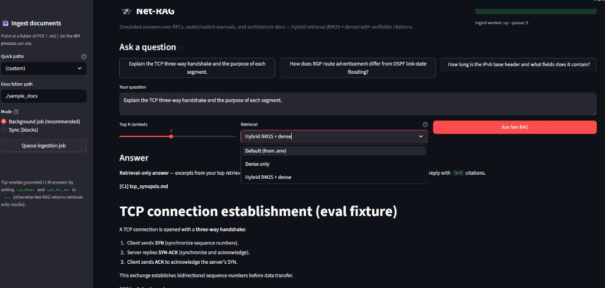

# Net-RAG: Network Protocol & Architecture Assistant

**Repo:** https://github.com/kaustubhchaudhari11/net-rag



I built **Net-RAG**, a Retrieval-Augmented Generation (RAG) assistant for the documents that actually run the internet — RFCs, router/switch manuals, and network architecture guides. You point it at a pile of dense technical docs and ask plain-English questions like *"Explain the TCP three-way handshake"* or *"How does BGP route selection differ from OSPF?"*, and it answers using the **real text from those documents**, with citations you can click and verify.

I started this because I was tired of "chat with a PDF" demos that look great until you ask something specific and the model confidently makes it up. Networking is unforgiving — get an RFC number or a header field wrong and the answer is worse than useless. So I treated this as a serious engineering problem: how do you make retrieval precise enough for technical jargon, keep the model honest, and still ship it like a real service?

## What makes it different from a normal chatbot

A plain chatbot answers from its training memory and can't show you where anything came from. Net-RAG looks things up first, then answers only from what it found:

- **Grounded answers with citations.** Every response is tied back to a source file and passage. If the documents don't cover the question, it says *"insufficient context"* instead of inventing an answer.
- **Hybrid search (BM25 + dense).** Pure semantic search is weak at exact tokens like `RFC 4271`, `SYN-ACK`, or `Hop Limit`. I fuse keyword search with embeddings using Reciprocal Rank Fusion so both exact terms and paraphrased questions land correctly.
- **Structure-aware chunking.** Docs are split by section/heading instead of blind fixed-size cuts, and each chunk keeps its page and section so citations are meaningful.
- **Built like a service, not a script.** A FastAPI backend and a Streamlit UI talk over HTTP, with a background job queue for ingestion so embedding a big corpus never blocks the app.

To be clear about scope: this is a well-engineered RAG pipeline, **not** a multi-agent system. There's no autonomous planning or agent loop — just solid retrieval, grounding, and systems design, which is what production RAG actually needs.

## Tech Stack

- **Language:** Python 3.11
- **Backend API:** FastAPI + Uvicorn
- **Frontend:** Streamlit
- **RAG orchestration:** LangChain
- **Vector store:** FAISS (local, on-disk)
- **Embeddings:** HuggingFace Sentence Transformers (`all-MiniLM-L6-v2`) — runs locally on CPU, so it's free and private
- **Lexical search:** `rank-bm25` (BM25 over the FAISS docstore), fused with dense results via RRF
- **Document parsing:** PyPDF + Markdown/text loaders
- **LLM (optional):** any OpenAI-compatible model for the final answer write-up; without a key it falls back to returning the retrieved passages

## How it works

```
Documents → structure-aware chunking → embeddings → FAISS index
                                                        │
Question → hybrid retrieval (BM25 + dense, RRF) → top passages
                                                        │
                              grounded answer + citations  (LLM optional)
```

Ingestion runs as a background job so the API stays responsive, and FAISS writes go through a single worker to stay consistent.

## Run it locally

Works on Windows, macOS, and Linux. The repo already ships a few real RFCs in `sample_docs/`, so you can try it without downloading anything.

**1. Clone the repo**

```bash
git clone https://github.com/kaustubhchaudhari11/net-rag.git
cd net-rag
```

**2. Create a virtual environment**

```bash
# macOS / Linux
python3 -m venv .venv
source .venv/bin/activate

# Windows (PowerShell)
python -m venv .venv
.\.venv\Scripts\Activate.ps1
```

If PowerShell blocks the activation script, run it without activating (see the commands in step 5), or use the helper scripts in `scripts/`.

**3. Install dependencies**

```bash
pip install -r requirements.txt
```

The first install pulls in PyTorch and the embedding model, so it takes a few minutes.

**4. (Optional) Enable LLM-written answers**

Copy the template and add a key if you want polished prose answers instead of raw passages:

```bash
cp .env.example .env       # Windows: copy .env.example .env
```

```
LLM_MODEL=gpt-4o-mini
LLM_API_KEY=your_api_key
```

Skip this and the app still works — it just returns the cited source passages directly.

**5. Start the two services (two terminals)**

```bash
# Terminal 1 — API
python -m uvicorn app.api:app --host 127.0.0.1 --port 8000

# Terminal 2 — UI
streamlit run app/ui.py
```

Open the UI at http://localhost:8501 (API docs live at http://localhost:8000/docs). In the sidebar, click **Update knowledge base** to index the documents, then ask away.

**Or just use Docker:**

```bash
docker compose up --build
```

This brings up both services with healthchecks; the UI waits for the API before starting.

## Where to get more documents

Drop any PDF, `.md`, or `.txt` into `sample_docs/` and re-index. Networking RFCs are the best fit — they're free and text-based:

- TCP — [RFC 793](https://www.rfc-editor.org/rfc/rfc793.txt)
- BGP — [RFC 4271](https://www.rfc-editor.org/rfc/rfc4271.txt)
- OSPF — [RFC 2328](https://www.rfc-editor.org/rfc/rfc2328.txt)
- IPv6 — [RFC 8200](https://www.rfc-editor.org/rfc/rfc8200.txt)

Vendor configuration guides (Cisco IOS, Juniper) and architecture PDFs work too.

## Sample questions to ask

There's also a **Demo questions** tab in the UI with these ready to click:

- **TCP:** "Explain the TCP three-way handshake and the purpose of each segment."
- **BGP:** "What is the role of the AS_PATH attribute in BGP?"
- **OSPF:** "How does OSPF flood link-state advertisements within an area?"
- **IPv6:** "How long is the IPv6 base header and what fields does it contain?"
- **Comparison:** "How does BGP route selection differ from OSPF's shortest-path computation?"

Ask something the docs don't cover (e.g. "How does QUIC handle congestion control?") to watch it say *insufficient context* instead of guessing.

## Technical challenges and how I solved them

A few real problems I hit while building this:

**1. Dense search kept missing exact terms.** Embeddings are great at meaning but mediocre at literal tokens, so questions mentioning a specific RFC number or flag often retrieved the wrong section. I added a BM25 keyword index alongside the dense index and combined them with Reciprocal Rank Fusion. Now exact terms and fuzzy questions both work, and you can toggle the strategy per query.

**2. The embedding model reloaded on every request.** Early on, each query was slow because the sentence-transformer weights were being loaded from scratch every time (I caught it in the logs — "Loading weights" on every call). I cached the model with `functools.lru_cache` so it loads once per process. Latency dropped immediately.

**3. Ingesting a big corpus blocked everything.** Embedding hundreds of chunks is slow, and FAISS doesn't like concurrent writers. I moved ingestion to a background job queue with a single worker thread, plus a `/ingest/status` endpoint and a live progress bar in the UI. The API stays responsive and writes stay consistent.

**4. Keeping the model honest.** I constrained answers to the retrieved passages, made every claim cite its source, and added an explicit "insufficient context" path so it won't fabricate when the corpus comes up short.

**5. Windows dev friction.** `Activate.ps1` is blocked on a lot of Windows setups, and shell scripts kept getting CRLF line endings that break on Linux. I added `.bat` helpers for Windows and a `.gitattributes` rule to force LF on scripts so the containerized version actually runs.

## API reference

| Method | Path | Purpose |
|--------|------|---------|
| `GET`  | `/health` | Liveness; `?detailed=true` adds ingest worker / queue depth |
| `POST` | `/ingest` | Synchronous ingest (blocks until done) |
| `POST` | `/ingest/job` | Queue a background ingest → `{ job_id, status_url }` |
| `GET`  | `/ingest/status/{job_id}` | Job state + progress |
| `POST` | `/query` | Body: `query`, optional `top_k`, optional `retrieval_mode` (`dense` \| `hybrid`) |

Full interactive docs at `/docs` when the API is running.

## Project structure

```
net-rag/
  app/
    api.py                 # FastAPI routes
    ui.py                  # Streamlit app
    config.py              # env-driven settings
    rag/                   # chunker, embedder, vector store, hybrid retrieval
    services/              # ingestion, background jobs, query/answer logic
  scripts/                 # run/setup helpers, evaluation
  docs/                    # architecture notes, eval corpus, deployment
  sample_docs/             # RFCs to index out of the box
  docker-compose.yml
```

## Future improvements

- Externalize the ingest queue to Redis/RQ so the API can run as multiple replicas.
- Swap FAISS for a managed vector DB (Qdrant or pgvector) behind the same retrieval interface.
- Add a cross-encoder re-ranker for an extra precision bump on close calls.
- Let users filter answers by a specific source document.

## License

MIT.
